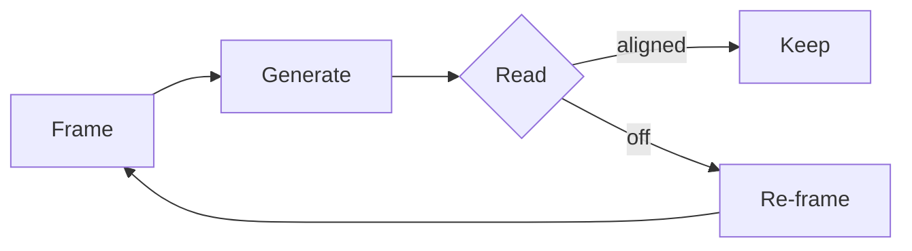
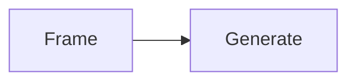

# Authoring posts

The convention. Pure markdown for prose. Imports for artifacts. The sync
script does the rest.

## TL;DR

```
~/Library/.../CloudDocs/Blog/posts/<slug>/
  index.md           ← required entry point with frontmatter
  _01-intro.md       ← optional: section partials (must start with `_`)
  _diagram.svg       ← optional: assets, referenced via imports
  _embed.astro       ← optional: interactive embeds
```

After writing: `npm run sync-blog && git push`.

## The folder rules

Every post is **a folder**. Not a flat file.

```
posts/<slug>/
  index.md           required — the post's entry point + frontmatter
  _*.md              optional — section partials, imported by index.md
  _*.{svg,png,jpg}   optional — diagrams, images, referenced via imports
  _*.astro           optional — interactive embeds or component wrappers
```

The folder name is the URL slug. Use **kebab-case** (`my-post-slug`).
`posts/<slug>/index.md` → `/notebook/<slug>`.

**Section partials and assets must start with `_`** (e.g. `_01-intro.md`,
`_diagram.svg`). The underscore tells Astro's content collection to skip
them as routes — they exist only to be imported by `index.md`.

Top-level folders or files starting with `_` (`_template`, `_draft-foo`)
are private — `npm run sync-blog` skips them entirely. Use `_` for scratch
posts that aren't ready, and for templates.

## Frontmatter schema

```yaml
---
title: "Post title"            # required, plain string
date: 2026-01-01               # required, YYYY-MM-DD
excerpt: "One-line summary."   # optional, used in listings
draft: false                   # optional, default false
---
```

That's the whole schema. See `src/content/config.ts` for the source of
truth.

## The simple convention: `import` + `{Name}`

Inside any `.md` file, you can declare imports at the top, then drop
`{Name}` on its own line wherever you want the artifact to render.

```md
---
title: "How to read a problem"
date: 2026-04-30
---

import Diagram from "./_diagram.svg"
import Intro from "./_01-intro.md"

When you hand a problem to an agent, you're not just transferring a task.
You're transferring a worldview.

{Intro}

## Where time goes

Most of the loop is in the bookends.

{Diagram}

The interesting work shifts from making to choosing.
```

That's it. Pure markdown body. Imports declare artifacts; `{Name}` on its
own line says "render here."

**Don't write an `# H1` heading at the top of the body** — the page
already renders the title from frontmatter. Start with prose, then `## H2`
for sections.

## What can be imported

The path's file extension determines how `{Name}` renders:

| Extension | Renders as | Notes |
|---|---|---|
| `.svg`, `.png`, `.jpg`, `.jpeg`, `.gif`, `.webp`, `.avif` | `` | The sync adds `?url` so Vite returns a string; the image renders full-width inside the post column. |
| `.astro` | The component | Use this for any interactive embed, custom layout, or pre-baked component wrapper (see "Components with props" below). |
| `.md` | The composed section | The partial gets converted to MDX during sync; its own imports + `{Name}` refs work too. |

Component imports (e.g. `import Foo from "@/components/post/Foo.astro"`)
work the same way — `{Foo}` renders `<Foo />`. But components that take
props or children don't fit on one line; see below.

## Components with props (the escape hatch)

The site has a small set of editorial components in `src/components/post/`
that take props or children: `Callout`, `Stat`, `Aside`, `Figure`,
`Diagram`. These don't fit the `{Name}` slot pattern.

The convention is to **wrap each use in a one-off `.astro` file** in the
post folder, then import and reference it like any other artifact:

```astro
---
// posts/the-ai-native-loop/_callout-shift.astro
import Callout from "@/components/post/Callout.astro"
---

<Callout title="The shift" variant="accent">
  The expensive thing isn't producing output anymore. It's reading output
  well, and re-framing fast when something's off.
</Callout>
```

```md
import Shift from "./_callout-shift.astro"

prose…

{Shift}
```

The `_` prefix keeps the wrapper out of routing.

If a post is heavy on parameterized components and one-off `.astro` files
feel like noise, you can fall back to writing `index.mdx` instead of
`index.md` and use the components inline with full MDX. Both work. Pick
the lighter syntax for the post.

## Two flavors

### Flavor 1 — Short post: everything in `index.md`

This is the default. Most posts should look like this.

```
posts/some-slug/
  index.md
  _diagram.svg     (optional)
```

### Flavor 2 — Long post: `index.md` composes section partials

When a post is long enough that one file is unwieldy, split sections into
separate `.md` files (each prefixed with `_` so it's not its own route)
and compose them in `index.md`:

```
posts/long-post/
  index.md
  _01-intro.md
  _02-context.md
  _03-method.md
  _04-findings.md
```

In `index.md`:

```md
---
title: "…"
date: 2026-04-30
---

import Intro from "./_01-intro.md"
import Context from "./_02-context.md"
import Method from "./_03-method.md"
import Findings from "./_04-findings.md"

{Intro}

{Context}

{Method}

{Findings}
```

Each section can have its own imports and `{Name}` refs. Single-file
posts are easier to edit; reach for partials only when the file has
become painful.

## Diagrams

### Mermaid

Just write a fenced code block. Mermaid is rendered client-side and the
site auto-frames it with a fullscreen toggle:

````md

````

The frame's topbar shows "Diagram" by default. To give a specific title,
add `title="…"` to the fence info string:

````md

````

### SVG / image diagrams

Drop the file in the post folder, prefix it with `_`, import it, drop the
ref:

```md
import Map from "./_problem-map.svg"

{Map}
```

If you want a caption beneath the image, wrap it in a `_figure-*.astro`
that uses `<Figure caption="…">…`.

### Interactive embeds

Write a `.astro` component in the post folder, prefix with `_`, import,
ref. If you want the framed-with-fullscreen container, wrap the inner
component in `<Diagram title="…">` inside the wrapper:

```astro
---
// posts/some-slug/_concept-graph.astro
import Diagram from "@/components/post/Diagram.astro"
import Graph from "./_graph-impl.astro"
---

<Diagram title="Concept map · drag the nodes">
  <Graph />
</Diagram>
```

```md
import ConceptGraph from "./_concept-graph.astro"

{ConceptGraph}
```

## Code blocks

Standard fenced code blocks work. Add a language for syntax highlighting:

````md
```ts
function frame(problem: Problem): Frame { … }
```
````

## Internal links

Cross-reference posts by URL: `[some-other-post](/notebook/some-other-post)`.

## Templates

A `_template/` folder lives in `~/.../Blog/posts/_template/`. Copy it to
start a new post:

```bash
cd ~/Library/Mobile\ Documents/com~apple~CloudDocs/Blog/posts
cp -r _template my-new-post
```

Then edit `my-new-post/index.md`. When ready: `npm run sync-blog`,
commit, push.

## What sync does

`npm run sync-blog`:

1. Wipes `src/content/notebook/`.
2. For each `.md` file: parses leading `import` lines, replaces `{Name}`
   refs with the appropriate JSX (image, component, partial), writes as
   `.mdx` so Astro/MDX can render it.
3. For each `.mdx` file (the escape hatch): rewrites any `.md` import
   paths to `.mdx` (since partials get extension-changed) and copies it
   through.
4. For other files (`.svg`, `.astro`, …): copies as-is.

Then commit `src/content/notebook` and push. The GitHub Actions workflow
deploys.

## Agent system prompt

Paste this into an agent (Claude, ChatGPT, an editor sidebar) that's
authoring posts here:

```
You're authoring a blog post for an Astro site at
~/Library/Mobile Documents/com~apple~CloudDocs/Blog/posts/<kebab-slug>/.

Conventions:

1. The post is a folder. The folder name is the URL slug (kebab-case).
2. The folder must contain index.md with YAML frontmatter:
   - title (string, required)
   - date (YYYY-MM-DD, required)
   - excerpt (one-line summary, optional)
3. index.md is pure markdown. To embed an artifact, declare an import at
   the top:  import Name from "./_path.svg"
   then drop  {Name}  on its own line where it should render.
4. Imports resolve by extension:
     .svg/.png/.jpg/etc.  → renders as 
     .astro               → renders as the component
     .md                  → renders as a composed section partial
5. Section partials and assets MUST be prefixed with _ (underscore) —
   _01-intro.md, _diagram.svg, _embed.astro. Otherwise Astro treats them
   as their own posts.
6. Don't write an H1 heading at the top of the body — the page renders
   the title from frontmatter. Start with prose, then ## H2 sections.
7. For mermaid, just write a ```mermaid fenced code block. No import.
8. For inline editorial callouts/stats/asides/figures with props, wrap
   each use in a one-off _wrapper.astro file (importing from
   @/components/post/) and reference it like any artifact.
9. Don't fabricate images. If a visual is needed but you can't generate
   it, leave a TODO note describing what should go there.
10. Keep prose tight. Editorial voice. Short sentences. No padding.
```
