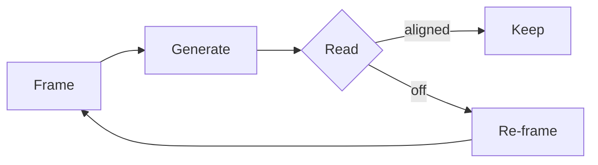

# Authoring posts

The convention. Pure markdown for prose, in two layers: a tiny `index.md`
that carries the metadata, and one or more body files that carry the
content. AI-agent friendly — no MDX, no `.astro` files inside posts.

## TL;DR

```
~/Library/.../CloudDocs/Blog/posts/<slug>/
  index.md         ← required: frontmatter + a single import of the body
  _01-body.md      ← required: the actual prose (always at least one body file)
  _02-section.md   ← optional: split long posts into more sections
  _diagram.svg     ← optional: assets, referenced via imports
  _embed.jsx       ← optional: interactive React embed (D3, mocks, etc.)
```

After writing: `npm run sync-blog && git push`.

## The three rules

1. **Every post is a folder.** The folder name is the URL slug (kebab-case).
2. **`index.md` carries only metadata.** It has YAML frontmatter and an
   import + reference for the body — nothing else. Even if the post is
   short.
3. **Everything else is `.md` or assets.** No `.mdx` files. No `.astro`
   files inside post folders. Bodies are `.md`. Interactive embeds are
   `.jsx` (React).

## `index.md` shape

```md
---
title: "How to read a problem"
date: 2026-04-30
excerpt: "One-line summary."   # optional
draft: false                   # optional, default false
fig: "FIG 1.4"                 # optional
---

import Body from "./_01-body.md"

{Body}
```

That's the whole file. Frontmatter, one import, one ref. The frontmatter
`title` already renders the H1 — don't repeat it in the body.

## Body files

Body files are plain markdown with two extensions:

- **`import Name from "./path"`** at the top → declares an asset / partial.
- **`{Name}` on its own line** in the body → renders the imported thing.

The path's extension determines how `{Name}` renders:

| Extension | Renders as |
|---|---|
| `.svg` `.png` `.jpg` `.jpeg` `.gif` `.webp` `.avif` | An `` taking the column width |
| `.md` | The composed section partial (recursively) |
| `.jsx` `.tsx` | A React component, hydrated client-side |

Body files start with a `_` prefix so Astro's content collection ignores
them as routes. Use a numbered prefix (`_01-body.md`, `_02-context.md`,
…) so they sort naturally and adding more is painless.

## Inline styling — plain markdown only

Posts don't use bespoke components. The site styles standard markdown
nicely; reach for:

| What you want | Use |
|---|---|
| A pull-quote / callout | A `>` blockquote (the site renders an ember left border) |
| Emphasis on a stat | **bold** for the number, plain prose for the rest |
| A margin note / aside | An `*italic paragraph*` |
| A figure with caption | The image ref + an italic line right below |
| A flowchart | A ` ```mermaid ` fenced code block (optionally with `title="…"`) |
| An interactive demo | A `_embed.jsx` React component, imported and referenced |

Examples:

```md
> **The shift.** The expensive thing isn't producing output anymore —
> it's reading output well, and re-framing fast when something's off.

**4×** — quality bump from a 30-second framing pass.

*Common case: you're asking the agent to optimize something, but the
thing you actually want is not what's being optimized.*

import Loop from "./_loop.svg"

{Loop}

*Where time goes in each loop. The orange band is generation; in the
old loop it dominates, in the new loop it's a sliver.*
```

## Mermaid diagrams

Just a fenced code block. Title is optional via the fence info:

````md

````

The site renders mermaid client-side with a dark theme and wraps it in
a framed container with a fullscreen toggle.

## Interactive React embeds

For anything that needs JavaScript (force graphs, app mocks, custom
canvas), write a `_name.jsx` (React) in the post folder:

```jsx
// posts/my-post/_my-demo.jsx
import { useEffect, useRef } from "react"

export default function MyDemo() {
  const ref = useRef(null)
  useEffect(() => {
    // …d3 / canvas / whatever…
  }, [])
  return <div ref={ref} className="my-demo" />
}
```

If you want it inside the framed-with-fullscreen chrome, render the
frame yourself in the component:

```jsx
return (
  <figure className="diagram-frame not-prose">
    <header className="diagram-topbar">
      <span className="diagram-title">My demo</span>
      <button
        type="button"
        className="diagram-action"
        data-diagram-action="open"
        aria-label="Open fullscreen"
      >
        <svg viewBox="0 0 16 16" width="13" height="13" fill="none"
             stroke="currentColor" strokeWidth="1.5"
             strokeLinecap="round" strokeLinejoin="round" aria-hidden="true">
          <path d="M2 6V2h4M14 6V2h-4M2 10v4h4M14 10v4h-4" />
        </svg>
      </button>
    </header>
    <div className="diagram-body">
      {/* your embed */}
    </div>
  </figure>
)
```

Then in the body:

```md
import MyDemo from "./_my-demo.jsx"

{MyDemo}
```

The sync emits `<MyDemo client:only="react" />` so the component skips
SSR and hydrates fully in the browser — important for anything that
touches `window`, `requestAnimationFrame`, d3, etc.

## Wiki-links

Cross-reference posts and concepts inline with double brackets:

```md
[[reading-the-problem-map]]
[[reading-the-problem-map|read this first]]
[[Frame]]
```

- Targets that match an existing post slug (or its slugified title) link
  to `/notebook/<slug>`.
- Targets that don't match any post become **concept stubs** in the
  graph at `/ideas`. They're not 404s — they get their own node and a
  list of which posts reference them.

The single pipe `|` lets you set custom display text without changing
the target.

## Code blocks

Standard fenced code blocks. Add a language for syntax highlighting:

````md
```ts
function frame(problem: Problem): Frame { … }
```
````

## Templates

A `_template/` folder lives in `~/.../Blog/posts/_template/`. Copy it to
start a new post:

```bash
cd ~/Library/Mobile\ Documents/com~apple~CloudDocs/Blog/posts
cp -r _template my-new-post
```

Then edit `my-new-post/index.md` (frontmatter) and `_01-body.md` (prose).

## What sync does

`npm run sync-blog`:

1. Wipes `src/content/notebook/`.
2. For each `.md` file: parses leading `import` lines, replaces `{Name}`
   refs with the appropriate JSX (image, component, partial), writes as
   `.mdx` so Astro/MDX can render it.
3. For `.jsx` / `.tsx`: copies through. Imports of these in body files
   render with `client:only="react"`.
4. For other files (`.svg`, `.png`, …): copies as-is.

Then commit `src/content/notebook/` and push. The GitHub Actions workflow
deploys.

> **Source of truth:** anything you want in the published site must live
> in `~/Library/.../CloudDocs/Blog/posts/`. The repo's `src/content/notebook/`
> is overwritten by sync. Files added there directly will be wiped on the
> next sync.

## Agent system prompt

Paste this into an agent (Claude, ChatGPT, an editor sidebar) that's
authoring posts here:

```
You're authoring a blog post for an Astro site at
~/Library/Mobile Documents/com~apple~CloudDocs/Blog/posts/<kebab-slug>/.

Conventions:

1. Every post is a folder. The folder name is the URL slug (kebab-case).
2. The folder MUST contain index.md with YAML frontmatter:
   - title (string, required)
   - date (YYYY-MM-DD, required)
   - excerpt (one-line summary, optional)
   - fig, draft (optional)
   index.md has frontmatter, one import, and one {ref}. Nothing else:

       ---
       title: "..."
       date: 2026-01-01
       excerpt: "..."
       ---

       import Body from "./_01-body.md"

       {Body}

3. The actual prose lives in _01-body.md (and _02-...md, etc. for long
   posts). These are plain markdown files starting with an underscore.
4. Inside body files, declare imports at the top:
       import Name from "./_path.ext"
   then drop {Name} on its own line where it should render.
5. Imports resolve by extension:
       .svg/.png/.jpg/etc.  → renders as 
       .jsx                 → renders as a React island (client:only)
       .md                  → renders as a composed section partial
6. Section partials and assets MUST be prefixed with _ (underscore) —
   _01-body.md, _diagram.svg, _embed.jsx. Otherwise Astro treats them
   as their own posts.
7. NEVER write .mdx or .astro files inside a post folder. The author-side
   format is .md only. Interactive embeds are .jsx (React).
8. Don't write an H1 heading at the top of the body — the page renders
   the title from frontmatter. Start with prose, then ## H2 sections.
9. For mermaid, just write a ```mermaid fenced code block. No import.
   Optional title via fence info: ```mermaid title="The new loop"
10. For inline styling, use plain markdown:
      > blockquote      → callout-style highlight
      **bold**          → emphasis on a stat
      *italic*          → margin note / aside
       +     → figure with caption (image followed by
       *caption text*      italic line)
11. Cross-reference posts and concepts with [[double brackets]]:
      [[some-post-slug]]            → link to that post
      [[Frame]]                     → concept stub (graph node)
      [[some-post|display label]]   → custom display text
12. Don't fabricate images. If a visual is needed but you can't generate
    it, leave a TODO note describing what should go there.
13. Keep prose tight. Editorial voice. Short sentences. No padding.
```
