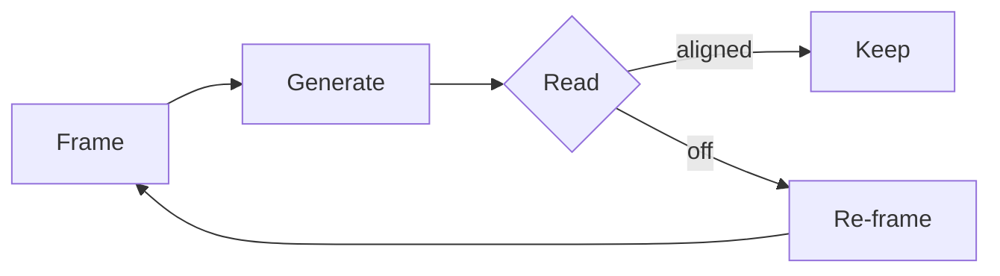

# Authoring posts

The convention. One pattern, two flavors. AI-agent friendly.

## TL;DR

```
~/Library/.../CloudDocs/Blog/posts/<slug>/
  index.mdx          ← required entry point with frontmatter
  *.svg, *.png, …    ← assets, referenced from index.mdx
  01-…, 02-…         ← optional partials for long posts
```

After writing: `npm run sync-blog && git push`.

## The folder rules

Every post is **a folder**. Not a flat file.

```
posts/<slug>/
  index.mdx          required — the post's entry point + frontmatter
  *.{md,mdx}         optional — section partials, imported by index.mdx
  *.{svg,png,jpg}    optional — diagrams, images, referenced relatively
  *.json             optional — data the post references (rare)
```

The folder name is the URL slug. Use **kebab-case** (`my-post-slug`).
`posts/<slug>/index.mdx` → `/notebook/<slug>`.

Folders or files starting with `_` (`_template`, `_draft-something`) are
**private** — `npm run sync-blog` skips them. Use `_` for scratch posts
that aren't ready, and for templates.

## Frontmatter schema

```yaml
---
title: "Post title"            # required, plain string
date: 2026-01-01               # required, YYYY-MM-DD
excerpt: "One-line summary."   # optional, used in listings
draft: false                   # optional, default false
---
```

That's the whole schema. It's intentionally small. See `src/content/config.ts`
for the source of truth.

## index.mdx structure

```mdx
---
title: "How to read a problem"
date: 2026-04-30
excerpt: "Before you solve it, structure the space."
---

import Callout from "@/components/post/Callout.astro"

When you hand a problem to an agent, you're not just transferring a task.
You're transferring a worldview.

## What gets lost

Three things, almost always.

<Callout title="Note">
The agent only sees what's in the prompt. Anything in your head has to
be made explicit.
</Callout>

The first is the boundary…
```

**Don't write an `# H1` heading at the top of the body** — the page already
renders the title from frontmatter. Start with body prose, then `## H2`
for sections.

## Two flavors

### Flavor 1 — Short post: everything in `index.mdx`

This is the default. Most posts should look like this.

```
posts/some-slug/
  index.mdx
```

Everything lives in `index.mdx`: frontmatter, all sections, all prose.

### Flavor 2 — Long post: `index.mdx` composes section partials

When a post is long enough that scrolling through one file gets painful,
break sections into separate `.md` files and import them.

```
posts/long-post/
  index.mdx          ← frontmatter + composition only
  01-intro.md        ← plain markdown, no frontmatter
  02-context.md
  03-method.md
  04-findings.md
```

In `index.mdx`:

```mdx
---
title: "…"
date: 2026-04-30
---

import Intro from "./01-intro.md"
import Context from "./02-context.md"
import Method from "./03-method.md"
import Findings from "./04-findings.md"

<Intro />

<Context />

<Method />

<Findings />
```

Astro/MDX renders each `.md` as a component. The result is one URL, one
post — but multiple files in the source.

Use this only when it earns its keep. Single-file posts are easier to
edit and review.

## Available components

Import from `@/components/post/`:

| Component | Use for |
|---|---|
| `Callout` | A highlighted note. Optional `title`, optional `variant="accent"` for ember tint. |
| `Stat` | Big number with a small caption. `value` (string) + `label` (optional). |
| `Aside` | Margin-style digression. Italic, dimmer. Optional `label`. |
| `Figure` | Wraps any visual (SVG, image) and adds a mono caption. |

Example use of all four:

```mdx
import Callout from "@/components/post/Callout.astro"
import Stat from "@/components/post/Stat.astro"
import Aside from "@/components/post/Aside.astro"
import Figure from "@/components/post/Figure.astro"

<Callout title="The shift">
The expensive thing isn't producing output anymore.
</Callout>

<Stat value="4×" label="quality bump from a 30-second framing pass" />

<Aside label="Common case">
You're optimizing the wrong thing. Reframe before generating.
</Aside>

<Figure caption="Where time goes">
  
</Figure>
```

## Diagrams and embeds

Every diagram and embed renders inside a **framed container** with a
fullscreen toggle in the corner. Click the icon to view the diagram
full-viewport; ESC or click again to exit.

### Mermaid (flowcharts, sequence diagrams, mindmaps)

Just write a fenced code block — the framing happens automatically:

````mdx

````

The site renders mermaid client-side with a dark theme: black background,
white edges, white borders. No imports required.

### Hand-drawn SVG or other static visuals

Wrap in `<Diagram>` (same frame as mermaid, fullscreen toggle included):

```mdx
import Diagram from "@/components/post/Diagram.astro"
import diagram from "./loop-shape.svg?url"

<Diagram caption="Where time goes">
  
</Diagram>
```

### Interactive or complex embeds

For anything that needs JSX, state, or its own logic (a custom demo, an
interactive widget, a chart with controls): write the embed as a
**separate `.astro` file in the post folder**, prefix it with `_` to mark
it as private, and import it into your `index.mdx`. Then drop it inside
`<Diagram>`:

```
posts/some-slug/
  index.mdx
  _retention-demo.astro    ← private partial; synced but not its own page
```

```mdx
import Diagram from "@/components/post/Diagram.astro"
import RetentionDemo from "./_retention-demo.astro"

<Diagram caption="Retention loop in motion">
  <RetentionDemo />
</Diagram>
```

The frame and fullscreen button are wired globally — every `.diagram-frame`
on the page picks up the same behavior. You don't need to wire anything
per-component.

## Images

Same pattern as SVG — drop the file in the post folder, import it:

```mdx
import cover from "./cover.jpg?url"


```

For local file imports, the `?url` suffix gives a plain URL string, which
plays well with `` and `<Figure>`.

## Code blocks

Standard fenced code blocks work. Add a language for syntax-aware
fonting:

````
```ts
function frame(problem: Problem): Frame { … }
```
````

## Internal links

Cross-reference other posts by URL: `[some-other-post](/notebook/some-other-post)`.

## Templates

A `_template/` folder lives in `~/.../Blog/posts/_template/`. Copy it to
start a new post:

```bash
cd ~/Library/Mobile\ Documents/com~apple~CloudDocs/Blog/posts
cp -r _template my-new-post
```

Then edit `my-new-post/index.mdx`. When ready: `npm run sync-blog`,
commit, push.

## Agent system prompt

If you want an AI agent (Claude, ChatGPT, an editor sidebar) to author or
edit posts in this convention, paste this as a system message:

```
You're authoring a blog post for an Astro site. Output a folder under
~/Library/Mobile Documents/com~apple~CloudDocs/Blog/posts/<kebab-case-slug>/
with these conventions:

1. The folder must contain `index.mdx` with frontmatter:
   - title (string, required)
   - date (YYYY-MM-DD, required)
   - excerpt (one-line summary, optional)
2. Don't write an H1 heading at the top of the body — the page renders
   the title from frontmatter. Start with body prose, then `## H2` for
   sections.
3. For diagrams, prefer ```mermaid fenced blocks for flowcharts. For
   editorial visuals, hand-write an SVG file alongside index.mdx and
   import it via `import diagram from "./diagram.svg?url"`.
4. For visual emphasis, import components from "@/components/post/":
     Callout (notes), Stat (big number), Aside (margin), Figure (wrap visuals).
   Don't invent new components unless explicitly asked.
5. If the post is long enough to feel painful in one file, split sections
   into 01-intro.md, 02-body.md, etc. (no frontmatter on those) and
   import them in index.mdx.
6. Don't fabricate images. If a visual is needed but you can't generate
   it, leave a TODO note and describe what should go there.
7. Keep prose tight. Editorial voice. Short sentences. No padding.
```
