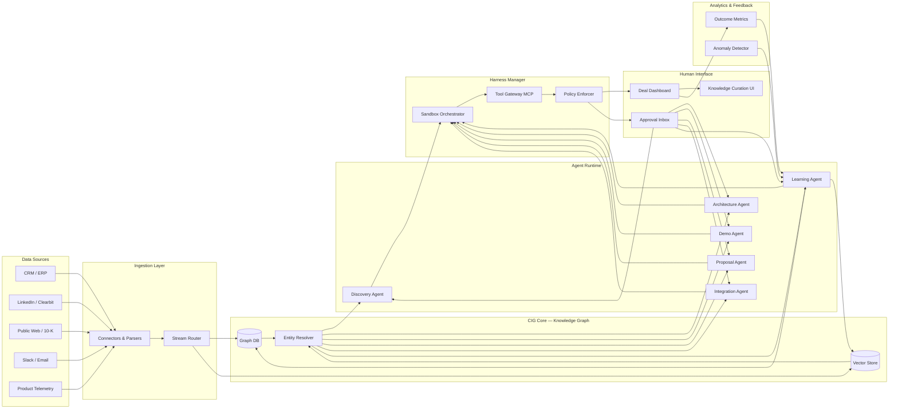

# 05 — Product Components: The System Map

An AI-native consultancy is not a monolith. It is a system of systems—data pipelines, reasoning runtimes, safety harnesses, and human interfaces that must work in concert. This document maps the product components, their responsibilities, and how they fit together into a deployable architecture.

## System Architecture Overview

The following diagram shows the high-level flow of data and control across the platform. Read it as a pipeline that moves from left (raw signals) to right (human decisions), with feedback loops that return lessons to the knowledge base.

## Core Components

### 1. Ingestion Layer

The ingestion layer is the platform's sensory nervous system. It collects raw signals from the outside world, normalizes them, and routes them into the knowledge graph.

**Sub-components:**
- **API Connectors:** Bi-directional adapters for Salesforce, HubSpot, Slack, Gong, LinkedIn, BuiltWith, and vendor portals. Each connector emits a normalized event schema.
- **Document Parsers:** Extract structured entities from PDFs, Word docs, PowerPoint decks, call transcripts, and email threads. OCR and table extraction are included for scanned documents.
- **Web Scrapers & Listeners:** Continuous monitoring of public filings, press releases, job postings, and competitor announcements. Change detection triggers delta updates.
- **Stream Router:** A Kafka or Pulsar-based event bus that applies routing rules (e.g., "all Salesforce opportunity updates go to the CRM ingestion topic") and dead-letter handling for malformed events.

**Why it matters:** As described in [02-Data-Model.md](02-Data-Model.md), stale data is worse than no data. The ingestion layer must guarantee freshness—weekly for tech stack signals, real-time for CRM events, quarterly for financials—with automatic TTL expiration and re-ingestion triggers.

**Example:** When ACME Corp updates its Salesforce opportunity stage to "Technical Validation," the ingestion layer captures the change within seconds, updates the deal node in CIG, and notifies the Demo Agent that it may begin environment provisioning.

### 2. Knowledge Graph (CIG Core)

The knowledge graph is the platform's memory. It is not a single database but a polyglot persistence layer optimized for different query patterns.

**Sub-components:**
- **Graph Database (e.g., Neo4j, Amazon Neptune):** Stores entities (companies, people, technologies, deals) and relationships ("employs," "previously worked at," "depends on"). Optimized for traversal queries like "find all CTOs who previously worked at a Snowflake partner."
- **Vector Store (e.g., Pinecone, Weaviate, pgvector):** Stores embeddings of documents, transcripts, and solution patterns. Enables semantic retrieval: "find the three most similar past engagements to this prospect."
- **Entity Resolver:** A dedicated service that performs deduplication, record linkage, and canonicalization. It resolves "Acme Inc." and "acme.com" to a single entity and merges duplicate person profiles across LinkedIn and CRM.
- **Ontology Manager:** Defines the shared schema for entities, relationships, and attributes. Version-controlled and extensible per tenant.

**Why it matters:** This is the implementation of organizational memory described in [02-Data-Model.md](02-Data-Model.md). Without the graph, agents are amnesiac. Without the vector store, they cannot reason over unstructured text. Without entity resolution, they hallucinate duplicate companies and double-count relationships.

**Cross-tenant isolation:** The graph supports tenant-scoped namespaces. A boutique SI's data is isolated from its competitor's data, but anonymized patterns (e.g., "retail data platform pricing benchmark") can be promoted to a shared layer with human curation.

### 3. Agent Runtime

The agent runtime is where reasoning happens. It hosts the six agent types defined in [01-Agent-Architecture.md](01-Agent-Architecture.md) and executes their loops (see [03-Agent-Loops.md](03-Agent-Loops.md)).

**Sub-components:**
- **Agent Registry:** A catalog of agent definitions, their prompts, model routing policies, and version history.
- **Loop Orchestrator:** A state machine that manages the five operating loops (Discovery, Solution, Delivery, Learning, Feedback). It handles sequencing, parallelism (swarm mode), and iteration (orchestration mode).
- **Context Assembler:** Injects retrieved knowledge from CIG into agent prompts, manages conversation summarization, and maintains working memory across multi-turn sessions.
- **Model Router:** Routes tasks to the most cost-effective model class (see multi-model orchestration in [04-Harness-Design.md](04-Harness-Design.md)). Falls back automatically on rate limits or outages.

**Why it matters:** The runtime must be stateful. An Architecture Agent may spend 45 minutes generating a complex integration plan across multiple model calls and tool invocations. The runtime persists intermediate state, handles resumption after interruption, and ensures that downstream agents receive structured outputs they can parse.

### 4. Harness Manager

The harness manager is the safety and control layer. Every agent runs inside a harness, and the harness manager provisions, monitors, and destroys these harnesses.

**Sub-components:**
- **Sandbox Orchestrator:** Spawns isolated execution environments per agent instance (network egress filters, scoped file system, resource limits, temporary identity). Uses containerization (e.g., Firecracker microVMs or gVisor) for strong isolation.
- **Tool Gateway (MCP):** Mediates all tool calls via the Model Context Protocol. Enforces allowlists, rate limits, parameter validation, and approval gates. See [04-Harness-Design.md](04-Harness-Design.md) for the full tool policy model.
- **Policy Enforcer:** Evaluates every agent action against governance rules: "Does this agent have permission to query this tenant's pricing data?" "Does this email draft require human approval before sending?"
- **Secret Injector:** Integrates with HashiCorp Vault or cloud-native secret managers to inject scoped credentials at runtime without exposing plaintext to agents.

**Why it matters:** The harness is what makes the platform enterprise-grade. A consulting firm will not deploy autonomous agents that can accidentally email a prospect, expose a client's data to another tenant, or spin up a $50K/month cloud instance unmonitored. The harness manager is the guarantee of safety.

### 5. Human Interface

The human interface is where consultants interact with the machine. It is not an afterthought; it is the primary workflow surface for the firm's staff.

**Sub-components:**
- **Deal Dashboard:** A real-time view of every active engagement. Shows which agents are running, their status, recent outputs (e.g., "Discovery Brief ready for review"), and pending human tasks.
- **Approval Inbox:** A unified queue for all actions requiring human sign-off: proposals, external emails, pricing changes, and novel architecture decisions. Supports batch approval and one-click escalation.
- **Knowledge Curation UI:** The interface through which engagement leads review Learning Agent outputs, approve or modify knowledge base updates, and manage the promotion of patterns from private to shared layers.
- **Conversational Interface:** A chat / Slack-like surface where humans can message agents, ask ad-hoc questions ("What do we know about ACME's new CTO?"), and override agent behavior inline.

**Why it matters:** As argued in [00-Vision.md](00-Vision.md), humans handle stakes; agents handle scale. The interface must make it trivial for a human to review an agent's work in under five minutes and override it in under ten seconds. Friction here kills adoption.

### 6. Analytics & Feedback Engine

The analytics engine closes the loop. It measures outcomes, detects systemic issues, and drives the Feedback Loop (see [03-Agent-Loops.md](03-Agent-Loops.md)).

**Sub-components:**
- **Outcome Metrics:** Tracks win/loss rates, time-to-close, margin realization, agent involvement per deal stage, and customer satisfaction.
- **Anomaly Detector:** Statistical and ML-based detection of deviations: "Healthcare win rate dropped 15% this quarter" or "Demo environments with Salesforce integrations close 40% more often."
- **Agent Performance Profiler:** Per-agent latency, token cost, tool failure rates, human override rates, and escalation frequency.
- **Feedback Generator:** Translates detected anomalies into structured recommendations for the Learning Agent or human leadership.

**Why it matters:** Without analytics, the platform is a black box. The analytics engine provides the evidence base for continuous improvement and the ROI narrative for buyers.

## Integration Points with Existing Tools

An AI-native consultancy does not replace a firm's existing stack. It orchestrates it. The platform must integrate deeply with the tools consultants already use.

| External Tool | Integration Depth | Data Flow | Control Flow |
|---------------|-------------------|-----------|--------------|
| **Salesforce / HubSpot** | Bi-directional, real-time | Syncs accounts, contacts, opportunities, and activities into CIG; writes agent outputs back as notes, tasks, and attachments | Agents read pipeline state; humans review outputs in CRM |
| **Slack / Microsoft Teams** | Bi-directional, event-driven | Ingests channel transcripts for relationship graph enrichment; pushes approval requests and agent alerts to dedicated channels | Humans approve actions via Slack interactive messages |
| **Gong / Chorus** | Ingestion-only | Imports call transcripts, sentiment analysis, and speaker metadata into the interaction history layer | Agents query transcripts for discovery context |
| **LinkedIn Sales Navigator** | Ingestion-only | Feeds people profiles, job changes, and company updates into the entity graph | Discovery Agent enriches stakeholder maps |
| **BuiltWith / StackShare** | Ingestion-only | Provides tech stack signals for architecture and competitive analysis | Architecture Agent maps integration points |
| **GitHub / GitLab** | Bi-directional | Reads integration code and runbooks; writes agent-generated integration scripts to scoped repositories | Integration Agent deploys and documents code |
| **Jira / Asana** | Bi-directional | Reads delivery milestones and blockers; writes agent-generated tasks and retros | Learning Agent correlates delivery outcomes with deal context |
| **DocSend / PandaDoc** | Ingestion-only | Tracks proposal engagement (opens, time-on-page) for the behavioral layer | Proposal Agent refines follow-up strategy |
| **Snowflake / Databricks** | Bi-directional (optional) | For firms that want the CIG analytics layer to run inside their existing data warehouse | Analytics engine queries warehouse; writes agent telemetry back |
| **SSO / Identity Provider** | Authentication-only | SAML 2.0 or OIDC for user authentication and role mapping | RBAC enforcement across all interfaces |

**Integration philosophy:** Prefer API-first, webhook-driven integrations. Avoid brittle screen-scraping. Where an API is read-only (e.g., Gong), cache aggressively and respect rate limits. Where an API is bi-directional (e.g., Salesforce), use idempotent writes and conflict resolution timestamps to prevent sync loops.

## Deployment Model: Hybrid Multi-Tenant

The platform uses a **hybrid multi-tenant** deployment model. This is not a compromise—it is a deliberate architecture that balances operational efficiency with data sovereignty.

### Shared Infrastructure (Multi-Tenant)
- **Agent runtime, harness manager, and ingestion pipelines** run on shared, auto-scaling Kubernetes clusters. This amortizes compute costs and simplifies operations.
- **Shared model inference endpoints** (e.g., OpenAI, Anthropic, or self-hosted vLLM) are pooled across tenants with用量-based routing.

### Tenant-Isolated Data (Single-Tenant per Client)
- **Knowledge graph databases and vector stores** are provisioned per tenant. A boutique SI never shares a Neo4j instance with a competitor.
- **Document storage (S3 / GCS buckets)** is tenant-scoped with IAM policies enforced at the infrastructure layer.
- **Encryption keys** are tenant-specific, managed via a KMS. The platform operator cannot decrypt a tenant's data without that tenant's key.

### Shared Knowledge Layer (Curated)
- **Anonymized solution patterns, pricing benchmarks, and competitive battlecards** live in a shared, read-only layer that all tenants can query. Promotion to this layer is gated by human curation, as described in [02-Data-Model.md](02-Data-Model.md).

**Why hybrid?** A pure multi-tenant SaaS model would make it impossible for a Big 4 firm to accept the platform—they will not risk cross-tenant data leakage. A pure single-tenant model (per-client Kubernetes clusters) would create unsupportable operational overhead at Eytan's stage. Hybrid gives each tenant sovereign data with shared intelligence and shared infrastructure costs.

## Scalability and Cost Considerations

### Compute Scaling
- **Agent runtime** scales horizontally via Kubernetes HPA based on queue depth. A burst of 50 new deals in a day triggers 20 additional agent pods, which scale back to zero overnight.
- **Graph queries** are cached at the application layer. Complex traversals (e.g., "find all second-degree connections to this CTO") are pre-computed via background jobs and stored as materialized views.
- **Vector search** uses approximate nearest neighbor (ANN) indices with auto-refresh schedules. For tenants with >10M vectors, shard by entity type.

### Model Cost Management
- **Token budgets per tenant:** Firms can set monthly LLM spend caps. The model router downgrades to cheaper models (e.g., GPT-4o-mini) when budgets are tight.
- **Caching:** Common agent queries ("What is our standard retail data platform architecture?") are cached at the embedding and generation layers. Cache hit rates above 60% are targeted.
- **Batching:** Non-interactive tasks (Learning Loop retros, Feedback Loop aggregations) run during off-peak hours using batch inference endpoints at 50-70% lower cost.

### Storage Growth
- **Interaction history** (call transcripts, emails) grows fastest. Implement tiered storage: hot (last 90 days) in SSD-backed graph, warm (1-2 years) in object storage with queryable metadata, cold (>2 years) archived with on-demand restore.
- **Vector embeddings** for old engagements can be compressed or re-embedded with a smaller model if retrieval quality remains acceptable.

### Cost Benchmarks ( illustrative, per-tenant / month )

| Component | Small Firm (~10 SEs, 50 deals/quarter) | Mid-Size SI (~100 SEs, 500 deals/quarter) | Global SI (~1000 SEs, 5000 deals/quarter) |
|-----------|----------------------------------------|-------------------------------------------|------------------------------------------|
| **Infrastructure** | $2,000–$3,000 | $12,000–$18,000 | $80,000–$120,000 |
| **LLM Tokens** | $1,500–$2,500 | $8,000–$15,000 | $60,000–$100,000 |
| **Data Storage** | $500–$1,000 | $3,000–$5,000 | $20,000–$40,000 |
| **Total Platform COGS** | $4,000–$6,500 | $23,000–$38,000 | $160,000–$260,000 |
| **Equiv. Consultant Hours Saved** | ~400 hrs/quarter | ~2,500 hrs/quarter | ~20,000 hrs/quarter |
| **Effective Hourly Cost** | ~$10–$16 / hr | ~$9–$15 / hr | ~$8–$13 / hr |

At scale, the platform replaces work that would cost $150–$300/hour in fully-loaded consultant time. The unit economics are compelling, but only if cost discipline is enforced from day one.

## Summary

The system map is purpose-built for the AI-native consultancy operating model described across the preceding documents. The ingestion layer feeds the knowledge graph, which feeds the agent runtime, which operates inside safety harnesses, which report to human interfaces, which generate analytics that improve the system over time. This is not a feature list. It is an architecture for a new kind of professional services firm—one that compounds intelligence instead of burning hours.
