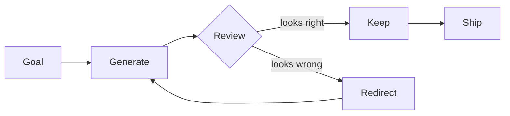

For most of the history of work, attention has been the multiplier and execution has been the bottleneck. You could think faster than the machinery could move. The interesting question was: what should I work on next? The expensive question was: how do I get this done?

That is no longer the right model.

## The new asymmetry

When agents can execute at near-zero marginal cost, the bottleneck inverts. Now the cheap thing is doing. The expensive thing is *deciding*. Picking the right next step. Noticing when a step is wrong. Recognizing the shape of a problem before too much has been built around it.

[[Attention]] becomes the rarest resource in the workflow.

## What that changes

A few things start to look different:

- **Reviewing matters more than producing.** The skill of looking at output and seeing what's wrong (or what's missing) is now the high-leverage skill — see [[Read]].
- **[[Taste]] compounds.** When you can generate ten variations cheaply, the only thing that distinguishes the result is what you choose to keep.
- **[[Context]] is the new compile time.** Loading the right context into an agent is a real cost — and a real skill.

## What I'm watching

The interesting tools right now are the ones that compress the attention loop — that let me notice, decide, redirect, faster. Most of what I'm building these days fits that shape. I'll write about specific instruments next.

The shape I keep returning to:

Most of the leverage is in the `Review` node. The cheaper generation gets, the more that node has to carry.
