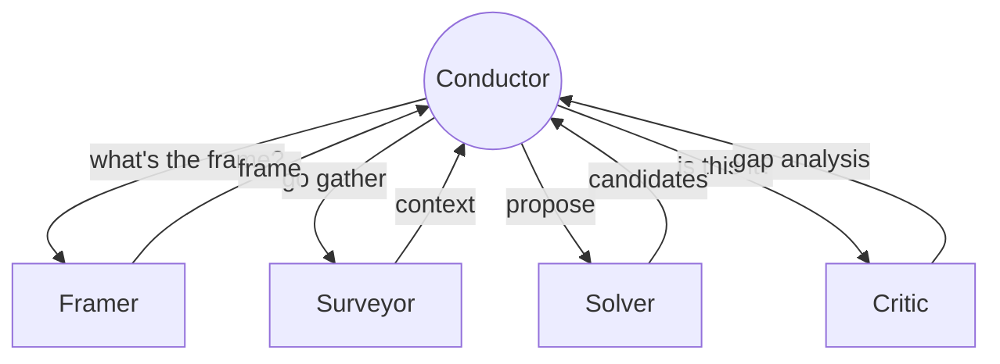

## The cast

The minimum viable system has five roles. Whether you implement them as five distinct agents, five different prompts run by one orchestrator, or one agent told to switch hats — the *roles* matter more than the runtime.

**Framer.** Reads a vague problem statement and produces a structured frame: goal, scope, constraints, success criteria. Re-runs whenever new evidence shifts the frame. The Framer's first output is almost always wrong; that's not a bug. The frame is meant to be revised.

**Surveyor.** Goes out and gathers context. Reads docs, queries data, scans prior work, finds adjacent problems already solved. Doesn't propose solutions; just maps the territory and reports. Most of the value of an AI-native system lives here, in the work humans systematically under-do.

**Solver.** Generates candidate moves within the *current* frame. Diverges fast, doesn't commit. Three to seven candidates is usually right; one is too few to compare and twenty is procrastination.

**Critic.** Evaluates candidates against the frame's success criteria. Names what's missing. The Critic is *not* a thumbs-up/thumbs-down agent — its job is gap analysis: this candidate fails on this criterion, that one is unverifiable in the available time.

**Conductor.** The orchestrator. Decides which agent to run next based on the current state. Knows when to stop, when to re-frame, when to gather more, when to keep generating. The Conductor is the rare role that has no LLM-shaped equivalent in the literature, because it is mostly bookkeeping plus a decision rule.

These aren't sequential. The Conductor runs all of them on a loop, in whatever order the state demands. A run might call Framer once and Solver six times; another might call Framer four times and never run Solver until the third frame.
