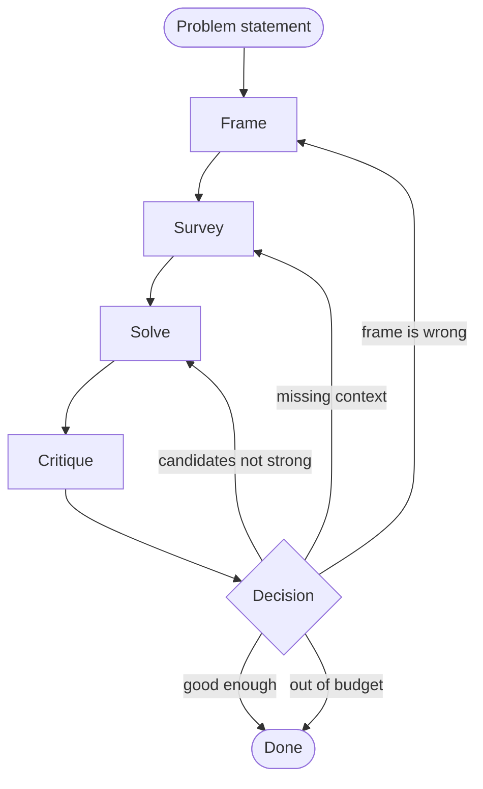

## How it actually runs

The Conductor's state machine. Read this as: at every step, the Conductor decides what to do next based on the current state.

The decision node is the entire game. The Conductor reads the Critic's gap analysis and chooses one of:

1. **Done.** Candidate clears the bar; ship the answer.
2. **Re-frame.** The Critic surfaced something that contradicts the frame's assumptions. The frame itself is wrong. Loop back to Frame with new info.
3. **Re-survey.** The Critic flagged "we don't have enough context to evaluate this." Loop back to Survey with a more targeted question.
4. **Retry.** The frame is right and the context is sufficient, but the candidates aren't good enough. Loop back to Solve, possibly with new instructions.
5. **Stop.** Out of budget. Surface what we have. Don't pretend we're done.

> **The hardest part.** Most failed AI systems I've seen got the first four agents right and got the Conductor wrong. The Conductor is mostly bookkeeping plus a decision rule. The decision rule is where taste lives.

A good Conductor:

- **Knows when to widen vs deepen.** If the Critic keeps flagging the same gap, gathering more of the same context won't help — re-frame. If the Critic flags different gaps each round, you're converging; keep gathering.
- **Has a budget.** Calls cost money and time. The Conductor needs an explicit ceiling and the discipline to stop before crossing it, even with no clean answer.
- **Surfaces uncertainty.** If the system stops without a clear answer, the output is "here's what we know, here's what we don't, here's the cheapest next test." Not a fake confident answer.

The hard part isn't writing the Conductor — it's *evaluating* the Conductor. There's no objective "right" decision rule. Good Conductors are the ones whose decisions look right *in retrospect* across many problems. That's the part that takes practice.
