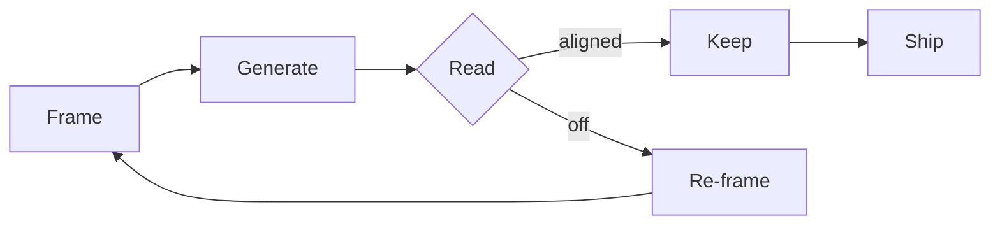

import Diagram from "./_diagram.svg?url"

There's a pattern I keep seeing among people who get a lot out of AI — and people who don't.

The ones who don't are running a familiar loop, with a faster autocomplete in the middle. They write, they ask, they read, they decide. The AI is a typing assistant.

The ones who do are running a different loop entirely.

## The shape of the new loop

[[Frame]], [[Generate]], [[Read]], decide. Repeat. The frame is now an artifact you keep refining, not a one-time setup.

> **The shift.** The expensive thing isn't producing output anymore. It's reading output well, and re-framing fast when something's off. The skill of *reading* — what's right, what's missing, what's almost-right-but-wrong — is what's becoming valuable.

## Where the leverage actually is

If you're spending most of your loop time generating, you're working in the old shape. The new shape spends most of the time in **frame** and **read** — the bookends. Generation collapses to seconds.

*Where time goes in each loop. The orange band is generation; in the old loop it dominates, in the new loop it's a sliver.*

The bookends are where the human's time and judgment actually live.

## What I'm trying to do

I'm trying to retrain my own loop. Less time typing. More time [[Frame|framing the question]] and [[Read|reading the answer]]. The first version of any output is now a draft *to react to*, not a destination. The discipline is described more carefully in [[reading-the-problem-map|the field guide on reading a problem]].

The interesting work shifts from *making* to *choosing*.
