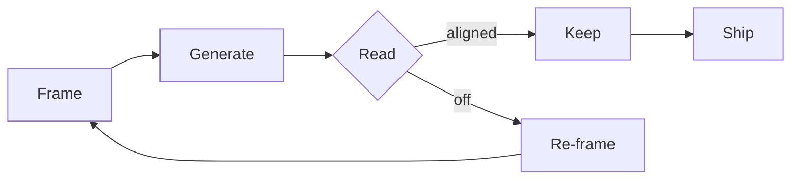

import Shift from "./_callout-shift.astro"
import Loops from "./_figure-loops.astro"

There's a pattern I keep seeing among people who get a lot out of AI — and people who don't.

The ones who don't are running a familiar loop, with a faster autocomplete in the middle. They write, they ask, they read, they decide. The AI is a typing assistant.

The ones who do are running a different loop entirely.

## The shape of the new loop

Frame, generate, read, decide. Repeat. The frame is now an artifact you keep refining, not a one-time setup.

<Shift />

## Where the leverage actually is

If you're spending most of your loop time generating, you're working in the old shape. The new shape spends most of the time in **frame** and **read** — the bookends. Generation collapses to seconds.

<Loops />

The orange band is generation. In the old loop it dominates. In the new loop it's a sliver, and the bookends are where the human's time and judgment actually live.

## What I'm trying to do

I'm trying to retrain my own loop. Less time typing. More time framing the question and reading the answer. The first version of any output is now a draft *to react to*, not a destination.

The interesting work shifts from *making* to *choosing*.
